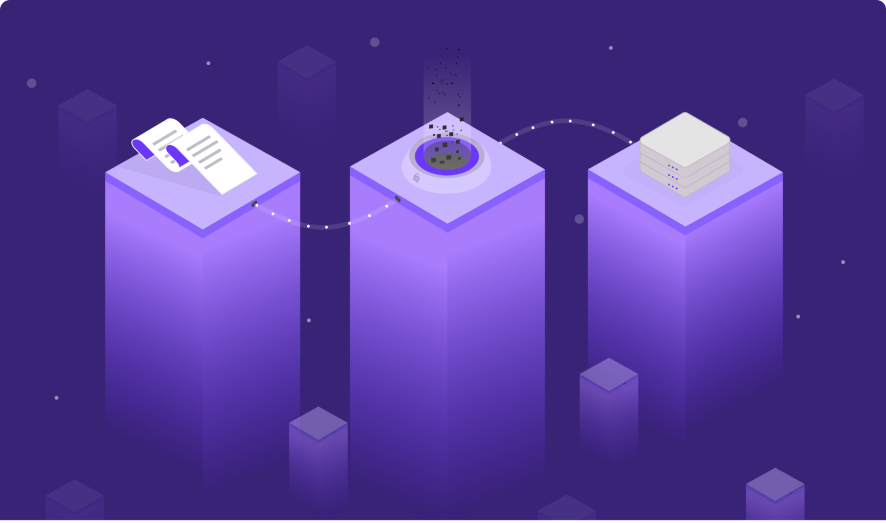
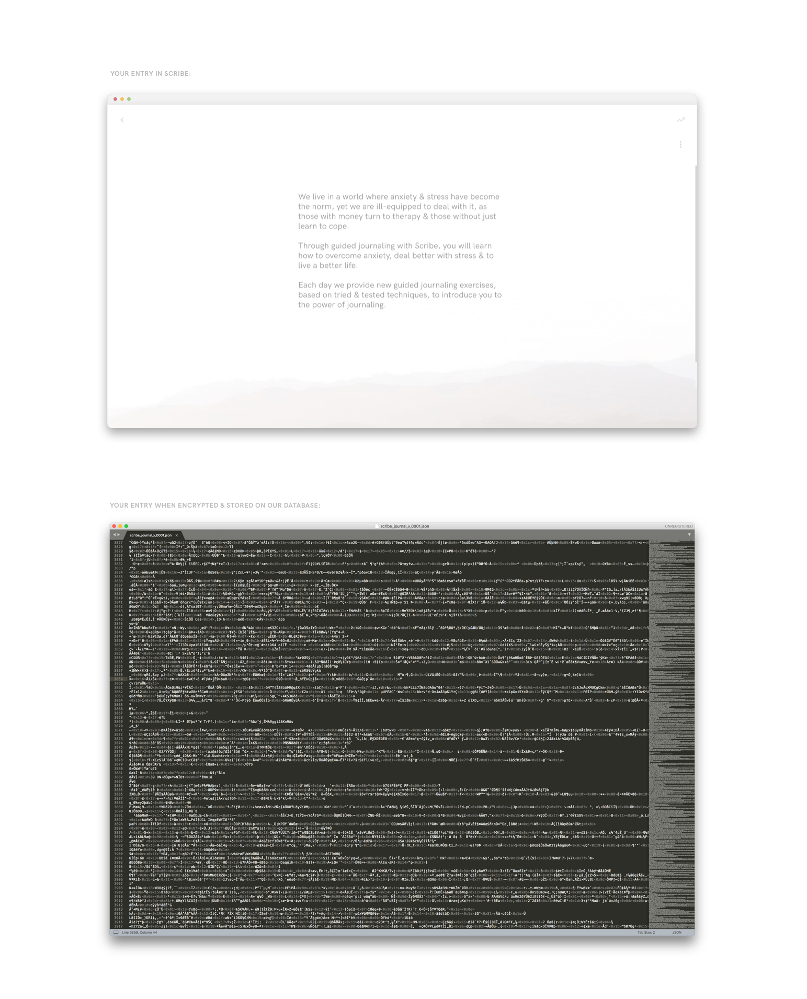

### We Take Data Protection Seriously

A journal is the one place we portray ourselves candidly.

There’s no filter. We aren’t projecting a certain image of ourselves to others, like on Instagram or when we meet people in person. We aren’t trying to be the person we think others would like. We aren’t trying to please anyone but ourselves.

We write about our inner-most fears, our hopes, our desires, our plans for the future. We write about our past, about the regrets, the losses, the fond memories. We simply write about our day, each day.

Yet how candid are we with ourselves when we write? If there’s no secure lock on our writing, are we truly honest with ourselves? Or do we always add a filter, just in case someone decides to come along and read our thoughts?

Jonathan & I, the founders of Scribe, have journaled for 13 years between us.

We are, in some ways, greatly indebted to writing in improving our lives — whether giving us the mental clarity required to realise when we are unhappy or to calm us in times of difficulty.

And we know that feeling, that nagging doubt, that comes from writing in a potentially public space. From writing when those words could be read by someone else.

And that doubt prevents you being truly honest with yourself. From truly expressing yourself.

It denies you the true value of unfiltered introspection.

Which is why one of the first features we decided to build was secure login and data encryption.

<figure>
	
	<figcaption>As you write, words are saved, encrypted, then stored on our servers, only being unencrypted when accessed on your password-protected account</figcaption>
</figure>

### Encrypting your Data

This means:

1. Password protection

All your writing is stored on an email & password-protected account. This means that, even though your journal data is stored locally, it is encrypted (and essentially inaccessible) unless you are logged into your password-protected account *on your local device*.

2. Encrypted cloud storage

Whenever you type something on your device, that text will be converted to an encrypted piece of code that is sent to our secure cloud storage.

As you type, each journal entry is being stored on our cloud, but encrypted behind a service that scrambles that text so nobody can ever read your entries. Your data is completely unreadable.

When you open the app again, and see your previous entries on your account, the app is retrieving that scrambled text we sent to the cloud when we were writing, and encoding it with a unique key that is only accessible from within your account.

Essentially, if you are logged in, the key will unlock your encrypted data from the cloud.

This happens on a continuous basis, with text auto-saved to the cloud as you type, and retrieved every few milliseconds when you have the app open on your device.

The only way, therefore, to read a person's text is to be actively logged in to that user account, whereby a specific private key, stored locally on your device, will ‘translate’ that encrypted content so you can access it from within your Scribe account.

And that means you can write candidly without the fear of someone ever peering over to read what you’ve written.

So if you don’t want the guys at Evernote or Microsoft or Day One to read your journal, maybe it’s time to switch over to Scribe ;)

<figure>
	
	<figcaption>How your journal data looks once encrypted</figcaption>
</figure>

### Why Cloud Storage?

We strongly believe that cloud storage is the future.

Although it may make some people uneasy, cloud storage with encryption is the most secure way to store our personal data, as it is not difficult for someone to hack your local device and simply open your files there, if they so wished.

By storing data on a robust external server, protected behind their hack-prevention software and a unique key for each user, we make it very difficult for somebody to ever read your text.

Furthermore, as we move from device to device and technology changes, we believe it is important that you are still able to easily access your journal entries 10 years for now, in a format that still works & in a way that is easily accessible.

Cloud storage means, further, that we never lose that data: That you are always able to retrieve it with the right login credentials whenever you wish.
