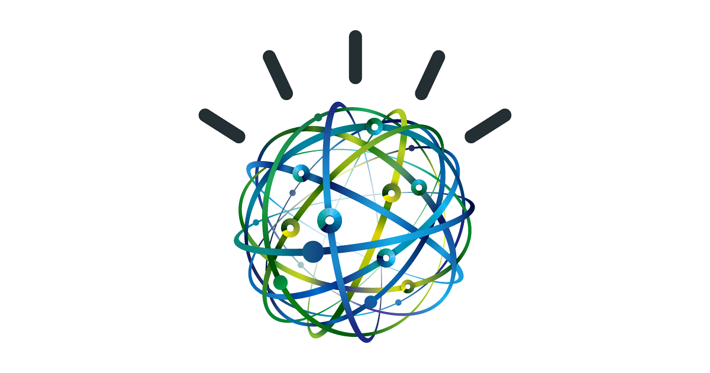

### How it works & how it will improve your life

One day in late 2017, I opened up my journaling tool - at that time a simple note-taking app - to write down the following:

<figure>
	<blockquote>
		
"I am miserable. I am miserable because I am in a job I hate, working for someone I don't respect, part of a work culture that goes against all my beliefs.

		<footer>
			<cite>Nov 12, 2017</cite>
		</footer>
	</blockquote>
</figure>

And yet, on some level, I had known this all along. All the four months that I had been working for that company, it had sat with me, somewhere, hidden away.

And it was only through journaling that I was able to finally identify the problem. To examine myself in a mirror and to face myself with honesty.

What if, though, that realisation didn't take four months, but one? Or a week even?

What if, rather than important thoughts & insights getting lost in the tide of our daily journaling, they could be picked out, turned over, examined by us.

How would seeing those insights from an objective source influence our thinking? Our actions? How, then, would our lives be different?

### What are Insights?

Our Insights feature does just that:

Selects a few key sentences from your journal entry & assigns them an emotional score (see how this works in detail at the bottom).

Some sentences will be 'Happy', others 'Sad', others 'Analytical'. Each can be interpreted in their own way by you. They are insights into your mood that only you are able to interpret yourself.

Some will be a waste of time: you don't need to know that a sentence like 'I am miserable.' is a 'Sad' sentence, for example.

Some will be inaccurate, for example a positive sentence that includes one strong negative word: 'It's sad to see John unhappy, but my life is great at the moment!'

But some, some of those gems, may be profound. They may be that slap in the face that you needed to realise something important in your life.

Maybe it's the negativity of your relationship, your dislike of your job, or just identifying the simple things that make you happy in life.

And yet even the obvious sentences are powerful over time; themes or phrases that keep on recurring trigger you to examine them in greater detail:

*'If my job negatively affects my mood, why specifically? Is it my boss? The commute? The lack of purpose? The lack of personal growth?'*

The more you write, the more insights you can derive from your writing.

(To read about how we securely encrypt your data, [check out this article on data security at Scribe.](https://help.scribeapp.co/data-privacy/))

### Insights Improve Your Quality of Life

And, at the end of the day, that means a better version of you. It means a version of you because it will help you make better decisions - and make those decisions better-informed & faster. To not leave problems unsolved, to not double down on the positives.

And, by making better decisions, you make a better life.

Try it out now by downloading our app (still in private Beta testing).

---

### How it Works

Our app is based upon IBM Watson, an AI tool, whose knowledge base comes from decades of machine-learning on the subject of psycholinguistics:

<figure>
	<blockquote>
		
The IBM Watson™ Tone Analyzer service is based on the theory of psycholinguistics, a field of research that explores the relationship between linguistic behaviour and psychological theories. The service uses linguistic analysis and the correlation between the linguistic features of written text and emotional and language tones to develop scores for each of these tone dimensions.

    
Psycholinguistics researchers work to understand whether the words that people use in their day-to-day lives reflect who they are, how they feel, and how they think. After several decades of research, it is now accepted in psychology, marketing, and other fields that language reflects more than just what people want to say. The frequency with which people use certain types of words can provide clues to their personality, thinking style, social connections, and emotional states.

    
For example, people exhibit various tones in their daily communications: joyful or sad, open or conservative, analytical or informal (Gou and others, 2014, and Jian and others, 2014). These tones can impact the perception of a person's online identity and the effectiveness of their communications in different contexts.

    
Moreover, in business email communications, people are likely to perceive negative emotions with greater intensity than they do positive emotions (Byron, 2008). And in social media, people present different online identities that impact the impression that others have of them (DiMicco and Millen, 2007).

		<footer>
			<cite>- IBM, 2018</cite>
		</footer>
	</blockquote>
</figure>

As stated above, research shows that there is a strong correlation between word choice & one's character - emotions, attitudes, values, thought processes (Fast and Funder 2008).

In short, the words you use accurately reflect you as a person.

And the work of our textual analysis tool is to detect - accurately and automatically - the correct tone for a piece of text, using artificial intelligence & cognitive science.

The specific emotions & tones Scribe analyses on your behalf are defined as follows:

+ `anger`: Anger is evoked due to injustice, conflict, humiliation, negligence, or betrayal. If anger is active, the individual attacks the target, verbally or physically. If anger is passive, the person silently sulks and feels tension and hostility. (An emotional tone.)

+ `fear`: Fear is a response to impending danger. It is a survival mechanism that is triggered as a reaction to some negative stimulus. Fear can be a mild caution or an extreme phobia. (An emotional tone.)

+ `joy`: Joy (or happiness) has shades of enjoyment, satisfaction, and pleasure. Joy brings a sense of well-being, inner peace, love, safety, and contentment. (An emotional tone.)

+ `sadness`: Sadness indicates a feeling of loss and disadvantage. When a person is quiet, less energetic, and withdrawn, it can be inferred that they feel sadness. (An emotional tone.)

+ `analytical`: An analytical tone indicates a person's reasoning and analytical attitude about things. An analytical person might be perceived as intellectual, rational, systematic, emotionless, or impersonal. (A language tone.)

+ `confident`: A confident tone indicates a person's degree of certainty. A confident person might be perceived as assured, collected, hopeful, or egotistical. (A language tone.)

+ `tentative`: A tentative tone indicates a person's degree of inhibition. A tentative person might be perceived as questionable, doubtful, or debatable. (A language tone.)

#### Emotional Tones

Analysing the emotion of a piece of text will remain difficult to get completely accurate for the next few years, considering the range of human emotions & our flexibility with language (think, for example, how difficult it would be for a computer to detect sarcasm).

However, IBM Watson is statistically more accurate than the most state-of-the-art models in the world.

To infer an emotion, our tool analyses n-grams, punctuation, emoticons, curse words, greetings, and sentiment polarity, feeding all of the results into a machine-learning algorithm that determines a final emotional score.

#### Language Tone

A language tone is determined through linguistic analysis based on learned features.

The accuracy of this feature was tested by analysing more than two hundred thousand sentences, with a team of human moderators verifying the accuracy of a random selection of over 1000 sentences per language tone.

### Use Your Own Judgment

Despite the accuracy of linguistic analysis using IBM Watson, it still takes human imagination & ingenuity to review the results.

It still requires you, the user, to extract what value you can from our raw analysis & to analyse the results yourself.

How accurate are they? What have the insights taught you about yourself? And what do you want to do about it?

(We are always looking for feedback on this feature, as it's very much a work-in-progress. [Fill out our 1-minute survey if you've tried out the app!](https://henrylatham.typeform.com/to/XGWXHt))
