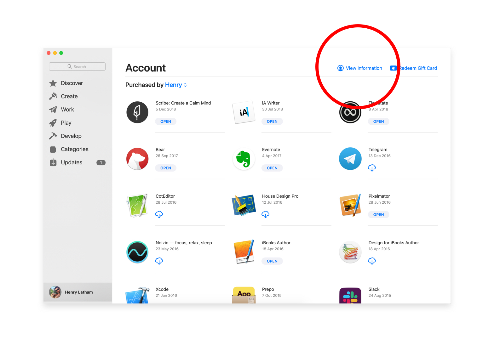
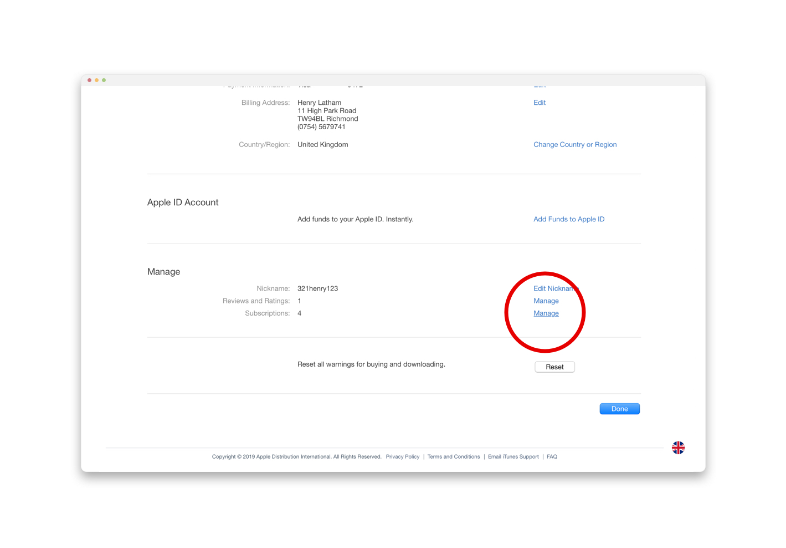

**Your Feedback is Really Helpful**

We are a small team working on a pretty new product, so any feedback on why you've subscribed is more valuable than you may imagine.
If you have time, [just a quick email](mailto:henry@scribeapp.co?Subject=Scribe%20Unsubscribe%20Feedback) to let us know 1) why you subscribed in the first place & 2) why you have unsubscribed will really help us improve the product for other users.

---

## Outsmarting Apple

Unfortunately Apple have total control over how the subscription process is managed, meaning we cannot allow you to simply unsubscribe through the Scribe app itself.

I suspect they have made it pretty difficult to work out how to unsubscribe to keep you locked in to paying for products you no longer use, but anyway.

Although we are obviously sad to see you go (and perplexed as to why anyone would ever *not* love our product), we aren't the kind of people to trick you in to paying for something you aren't using, so here are 2 quick steps to help you unsubscribe from our product:

### Step 1

Open the App Store app on your device and click 'View Information' in the top-right corner (the thing surrounded by a giant red circle, if you haven't found it yet).

### Step 2

Scroll down to the section titled 'Manage' and select the 'Manage' button which is inline with the row labeled 'Subscriptions' (again, the big red circle should guide you here).

On that page you can simply cancel or change your subscription.

