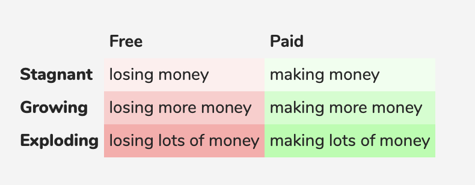

### Apps Cost A LOT to build

Do you remember all those cool startups featured in Wired or another-generic-startup-publication?

Remember how cool it was that their product was *free* and how you felt like you were winning every day using it?

And do you remember where it is now? Did you see that quietly posted little blog post on their website about how they won't able to achieve their mission and how they couldn't reach profitability and how they are really sorry they let all of their *free* users down?

Remember that?

Yeah, well you probably see the problem right:

That it was *free*.

Because *free* is great. For a while. Free means you can get a load of users who love the product, but may not be willing to pay for it.

And it works for a while because most startups are venture-funded, meaning a group of (usually white, middle-aged American) investors decide to give the hopes & dreams of some young techie types the funds to see what they can do.

So young white, male, American tech teams suddenly finds itself with a cool $1m in the bank and starts spending money on development and building up their customer base and *not* spending money on working out how to get to profitability.

And one day the money runs out.

-

The unfortunate reality is that **if you are not paying for a product, that product is not sustainable.**

We can follow a simple formula here:

More money in the company's pockets = higher chance the company is still around for the long-term.

And there is an important convex curve to be aware of (provided by the guys over at Nomad List):

The more customers a company acquires, the higher their costs are.

Thus the higher the pressure to make money from *somewhere* becomes.

This means companies either:

1. Collapse at some point and close

2. The team will need to sellout to some fun, friendly, faceless corporation that will either charge you for the product or milk you for data to make its money

This sounds a bit silly, right? Surely not that many companies do this?

Unfortunately - and somewhat shockingly - this is in fact the cultural norm: Build a business with sky-rocketing growth and sell it to a corporate and get out as quickly as possible, leaving your user base high and dry whilst you sip cold martinis (are martinis even cold? Who even drinks them?) on a beach somewhere, enjoying the next 50 years of retirement.

Therefore, we can distill this lesson down to a simple action:

Like a service? Pay for it.

### What is 'free'?

Without getting too deep into the nature of freedom itself, we can for simply just use the concept 'free' in terms of having no financial obligation for a service.

Yet what we tend to get for 'free' financially, we must always for in some other way.

In most cases, this means we pay in terms of our 'self'.

We offer our personal data - of who we hang out with, what we like, what we do on a daily basis - to big corporations like Facebook so they can better understand who we are as a person, so they are able to better understand our wants and needs better than we know them ourselves.

They gotta make money somewhere. And the make it from understanding better what 'you' really is, so they can then sell that data to advertisers, who in turn make an educated guess about the type of products you might be tempted to buy at specific times.

In 2018, for example, Facebook was found to allow advertisers to deliberately target teenage girls suffering from depression - some with signs of suicidal tendencies - with beauty products. Because that's gonna solve the problem, right?

At Scribe, we believe this is pretty fucked up.

We therefore take the following steps to ensure that 'free' never hides some hidden cost. This manifests itself in the following ways:

1. A free trial

We allow customers to try our app for free initially, so they can test out the app and see whether it provides them with enough value to pay for it. If you're not willing to pay for the app after that, then that's fine; you can still access the few entries you created and use the core value of the app: writing in an immersive environment to get your thoughts out on those few entry pages.

2. A subscription

If you like the app and want to continue with full functionality, you need to pay either monthly or annually to use it.

This payment allows us to do the following:

  a. Store and encrypt your data on secure servers so that nobody can ever read your private journal entries unless they are logged in to that user's account (which is itself protected behind a username and password). You can learn more about how seriously we take data privacy [here](../data-privacy/).

  b. Fund our development costs, which are significant, considering a full-time developer costs around $100,000 per year & each app version (iOS, Mac OS, Windows, Android, etc.) requires a different codebase and continuous updates

  c. Fund our founding team in order to create high-quality content to help customers understand themselves better

By charging for our product, we take your interests more seriously than those companies out to sell their business at the first opportunity and a make a quick buck.

We believe that, if you trust us with your inner thoughts through the Scribe journal, we have a moral obligation to protect that data and ensure it is securely stored indefinitely in future.

### How Much Does It Actually cost?

It looks pretty simple, right? You just sort of write in the thing and it stores them in these little cards when I want to read them.

Running a digital product-based company does, in fact, cost A LOT.

Here are some basic costs:

1. Hiring a full-time developer costs around $100,000 (as of 2019 we have two of them in our team and will soon require more)
2. 3 founders need a basic salary to cover living costs (which increase as we get older and want to buy a house, have kids, save some money for surfing & other fun hobbies during retirement, etc.)
3. Corporation tax and VAT: On every payment we receive, we need to pay about 30-40% to the UK government for running a business from there
4. Apple tax: As well as tax, Apple shave off 30% for each subscription payment for allowing us to use the App Store (& their payment services through the App Store)
5. Miscellaneous: Add to that a seat in a co-working ($150 per month per person), server costs (a few dollars per user), external platforms we use, such as email and analytics tools (~$1000+ per month) and some limited travel costs

We're looking at receiving, therefore, only about 30-40% per paying customer to fund our costs.

And we're looking at costs of around $300,000 simply to keep that company running each year on a shoestring budget in the first few years.

### Why not shower us with adverts?

Firstly, you need millions of impressions to even make enough money for a one-person team. That's why you'll struggle to find many full-time bloggers and writers online (whatever they may appear to be, they are very likely getting income from elsewhere).

Secondly, could we really show you an invasive advert popping up with a good looking fella selling shaving cream "for a great shave" whilst your trying to express your deepest, darkest emotions in our calming writing page?

Doesn't really work, does it?

### Still not worth it?

If you are *still* not convinced that you should just go ahead and pay for the app to help us achieve our dream of 1) helping create 76m calm minds and 2) enjoy an annual surf trip in Southern Europe as a team, then that's fine.

Just head over to your Apple account and you can easily turn off auto-renew so that no more payments will be taken from your account and you can leave your little old journals sitting there alone, wasting away in the past.
